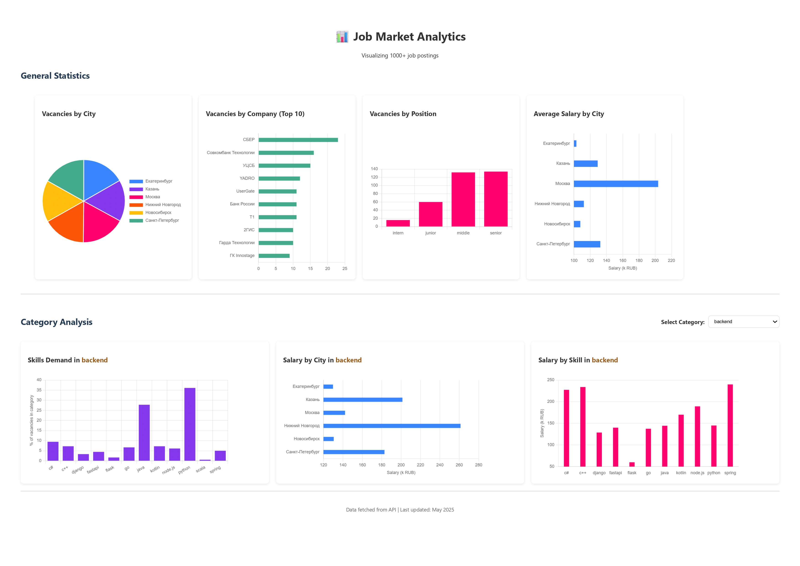

# Job Postings Analysis Dashboard



## 📌 Project Overview

A full-stack data pipeline that:
1. **Scrapes** 1000+ job postings from HeadHunter (hh.ru) API 
2. **Processes** and analyzes the data 
3. **Visualizes** key insights through an interactive dashboard with 7 detailed charts

## 📊 Visualization Dashboard

### General Statistics

- **Vacancies By City**: `city-pie-chart`
- **Company Analysis**: `company-bar-chart`
- **Position Trends (Intern/Junior/Middle/Senior)**: `position-bar-chart`  
- **Salary Distribution**: `salary-by-city-chart`

### Category Statistics
- **Skill Demand**: `skills-by-category-chart`
- **Salary Distribution**: `salary-city-category-chart`
- **Skill Benefit**: `salary-by-skill-chart`

## 🛠️ Tech Stack

- **Python** + **Flask** (REST API)
- **NGINX** (Web server & reverse proxy)
- **Docker** + **Docker Compose**

## 🐳 Docker Setup

To run the app use:
```bash
docker-compose up --build
```

Access dashboard: http://localhost